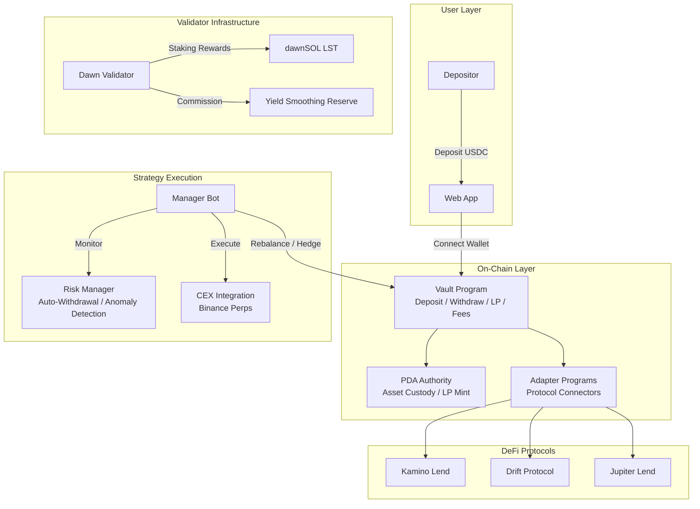

# Architecture

Dawn Vault uses a **two-layer architecture** for yield generation, built on the Voltr vault framework.

## Two-Layer Design

Every Dawn Vault follows the same structural principle:

```
Vault (Single Entry Point)
  ├── Base Layer  — Always-on, stable yield (lending / staking)
  └── Alpha Layer — Conditional, enhanced yield (activated when profitable)
```

The Base Layer ensures depositors always earn yield regardless of market conditions. The Alpha Layer activates only when market conditions are favorable, boosting returns without introducing unnecessary risk during unfavorable periods.

## System Architecture



## Core Components

### 1. Vault Program (On-Chain)

Built on **Voltr SDK**, the Vault Program handles:

- **Deposits & Withdrawals**: USDC in, LP tokens out (and vice versa)
- **LP Token Accounting**: Share price = Total Vault Assets / Total LP Supply
- **Fee Calculation**: Performance fee (HWM), management fee, redemption fee
- **Asset Custody**: All assets held in PDA accounts (non-custodial)

### 2. Adapter Programs (On-Chain)

CPI-gated connectors to external protocols:

- **Drift Adapter**: Lending, spot trading, perpetual positions
- **Kamino Adapter**: K-Lend deposits, LST multiply
- **Jupiter Adapter**: Lend, swaps

Adapters are whitelisted — only approved protocols can interact with vault assets.

### 3. Manager Bot (Off-Chain)

The automated strategy execution engine:

- **Dynamic Allocation**: Monitors funding rates and adjusts base/alpha allocation
- **Rebalancing**: Moves capital between lending protocols for optimal rates
- **Hedge Management**: Opens/closes delta-neutral positions on Binance
- **Risk Monitoring**: Watches for anomalies, funding rate reversals, oracle issues

### 4. Risk Manager (Off-Chain)

Autonomous safety system with escalation levels:

| Level | Trigger | Response |
|-------|---------|----------|
| Critical | Protocol exploit, imminent liquidation | Immediate auto-withdrawal + human alert |
| High | FR reversal, oracle delay, LTV spike | Bot auto-response + human confirmation |
| Medium | Spread narrowing, rising borrow rates | Alert → human decision |
| Low | Lending APY decline | Address at next rebalance |

## Security Model

- **Non-Custodial**: Assets stored in PDA accounts, not controlled by any individual
- **Permission Separation**: Admin (multisig) vs. Manager (bot) with distinct privileges
- **Adapter Whitelisting**: Only approved protocol adapters can access vault funds
- **Locked Profit**: Yearn V2-style linear release prevents sandwich attacks
