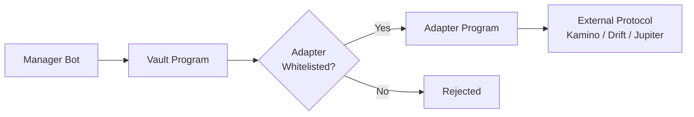

# Smart Contract Security

Dawn Vault's security model is built on three principles: **non-custodial architecture**, **permission separation**, and **adapter whitelisting**.

## Non-Custodial Design

All vault assets are held in **Program Derived Accounts (PDAs)** controlled by the Vault Program — not by any individual or multisig wallet.

- No single person can withdraw vault funds
- Assets can only move through program-defined operations (deposit, withdraw, rebalance via adapters)
- Depositors can always withdraw by burning their LP tokens

## Permission Separation

The vault separates two levels of authority:

| Role | Permissions | Holder |
|------|------------|--------|
| **Admin** | Add/remove adapters, change fees, replace manager, calibrate HWM | Multisig (Squads) |
| **Manager** | Execute rebalances, harvest fees, manage positions via adapters | Manager Bot |

The Manager Bot **cannot**:
- Add new adapters (only Admin)
- Change fee parameters (only Admin)
- Withdraw to arbitrary addresses (PDA-enforced)
- Bypass adapter whitelisting

## Adapter Whitelisting

External protocol interactions are gated through **Adapter Programs**:

- Only whitelisted adapters can access vault funds
- Each adapter is a purpose-built program for a specific protocol
- Adding a new adapter requires Admin (multisig) approval
- Adapter code is auditable on-chain

## Voltr Framework

Dawn Vault is built on the **Voltr** vault framework by Ranger Finance:

- Battle-tested with multiple vaults in production
- LP token accounting with share price model
- Built-in fee management (Performance, Management, Issuance, Redemption)
- High Water Mark (HWM) tracking for fair performance fee calculation
- Locked Profit mechanism (Yearn V2-style) to prevent sandwich/frontrun attacks

## Anti-MEV Protections

- **Locked Profit**: Profits are released linearly over a configurable duration, preventing attackers from depositing right before a profit event and withdrawing immediately after
- **Redemption Fee**: 0.1% withdrawal fee makes sandwich attacks unprofitable
- **Priority Fee Management**: Critical transactions use elevated priority fees to ensure timely execution

## Future Security Roadmap

- Formal smart contract audit by third-party security firm
- Bug bounty program
- On-chain monitoring and alerting integration
- Multi-venue CEX integration to reduce single-exchange dependency
