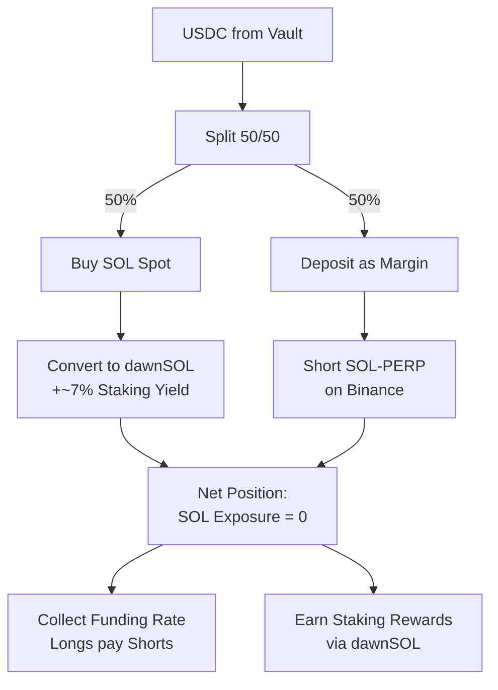
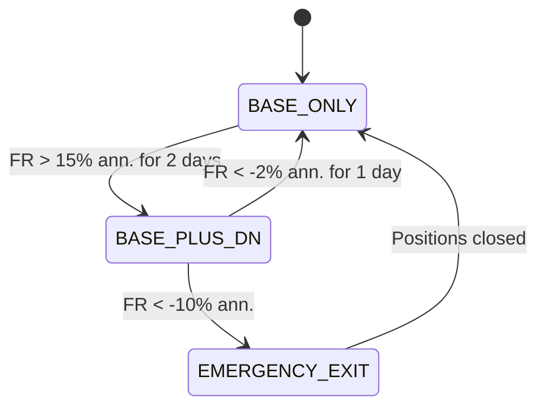

# Delta-Neutral Strategy

The delta-neutral (DN) strategy is the **Alpha Layer** of the USDC Vault. It captures SOL funding rate payments while maintaining zero directional exposure to SOL price movements.

## Mechanism

### Step-by-Step

1. **Split USDC 50/50**: Half for spot, half for margin
2. **Buy SOL spot** and convert to **dawnSOL** (Dawn Labs' LST)
3. **Open equal-sized SOL-PERP short** on Binance using the other half as margin
4. **Net SOL exposure = 0**: Spot long cancels out perp short
5. **Collect two yield streams**:
   - Funding rate payments (when positive — longs pay shorts)
   - dawnSOL staking rewards (~7% APY)

### Why dawnSOL?

By holding the spot leg as dawnSOL instead of native SOL, the strategy earns **staking rewards on top of funding rate income**. This validator-native enhancement adds ~7% APY that competitors using plain SOL cannot access.

## Funding Rate Explained

Perpetual futures use funding rates to keep their price aligned with spot. When the market is bullish:

- Longs outnumber shorts → **Funding rate is positive**
- Longs pay shorts periodically (typically every 8 hours)
- Our short position **collects** these payments

When the market is bearish, funding rates turn negative and shorts pay longs — this is when the DN strategy is **deactivated**.

## Entry / Exit Logic

The strategy uses backtested threshold parameters to decide when to activate or deactivate:

| Trigger | Condition | Action |
|---------|-----------|--------|
| **Entry** | SOL FR > 15% annualized, sustained 2 days | Allocate up to 50% to DN |
| **Reduction** | SOL FR < -2% annualized, sustained 1 day | Stop new allocations |
| **Gradual Exit** | SOL FR < 0% for 3 days | Wind down positions |
| **Emergency Exit** | SOL FR < -10% annualized | Immediate full close |

## No Leverage Policy

**Dawn Vault does not use leverage in the DN strategy.**

Example with $20,000 USDC:
- $10,000 → Buy SOL spot (→ dawnSOL)
- $10,000 → Margin for SOL-PERP short on Binance

Since margin equals position size (1x), liquidation risk is effectively zero. We prioritize **risk elimination** and operational simplicity over capital efficiency.

## Yield Composition

| Source | Estimated APY | Condition |
|--------|--------------|-----------|
| Funding Rate (net) | 8–23% | When FR is positive |
| dawnSOL Staking | ~7% | Always-on while position is held |
| **Combined** | **15–30%** | During favorable FR periods |

## Risks

| Risk | Description | Mitigation |
|------|-------------|-----------|
| **FR Reversal** | Funding rate turns negative; shorts pay longs | Automated exit thresholds |
| **Basis Risk** | Perp price diverges from spot | Position sizing limits; spread monitoring |
| **Execution Risk** | Slippage on entry/exit | Priority fee adjustment; optimal routing |
| **Exchange Risk** | CEX operational/counterparty risk | Position limits; multi-venue consideration |

## Historical Performance

See [USDC Vault — Performance](../vaults/usdc-vault.md#performance) for detailed backtest results.
