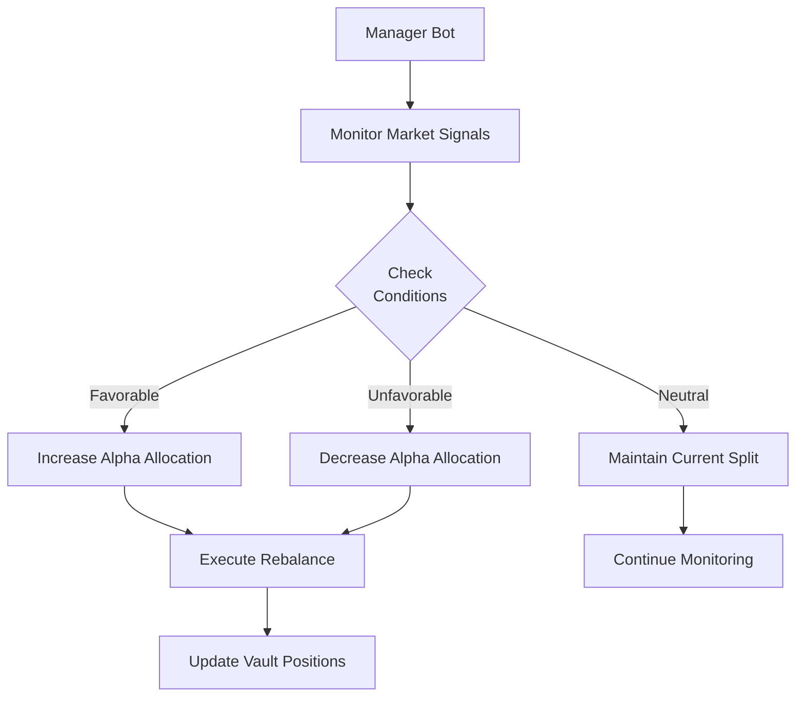

# Dynamic Allocation

Dynamic allocation is the core decision-making logic that determines how vault assets are distributed between the Base Layer and Alpha Layer.

## Design Philosophy

> Every Dawn Vault follows one rule: **yield should never drop to zero.**

The Base Layer (lending or staking) runs continuously. The Alpha Layer only activates when market conditions make it profitable. This two-layer design means depositors always earn something, with upside capture during favorable periods.

## How It Works



### Decision Inputs by Vault

| Vault | Primary Signal | Secondary Signals |
|-------|---------------|-------------------|
| **USDC Vault** | SOL Funding Rate | Lending rates across protocols |
| **SOL Vault** | LST yield − SOL borrow rate spread | Staking APY, borrow rate trends |
| **BTC Vault** | SOL FR + USDC borrow cost | BTC price, collateral LTV |

## USDC Vault Allocation Model

The USDC Vault uses a **state machine** with two states:

```
BASE_ONLY ←→ BASE_PLUS_DN
```

### State Transitions

| From | To | Condition |
|------|----|-----------|
| BASE_ONLY | BASE_PLUS_DN | SOL FR > 15% annualized for 2 consecutive days |
| BASE_PLUS_DN | BASE_ONLY | SOL FR < -2% annualized for 1 day |
| BASE_PLUS_DN | EMERGENCY_EXIT | SOL FR < -10% annualized (no time condition) |

### Allocation Ranges

| State | Lending | Delta-Neutral | Liquidity Buffer |
|-------|---------|---------------|-----------------|
| BASE_ONLY | 100% | 0% | Included in lending |
| BASE_PLUS_DN | 30–50% | 50–70% | 30% minimum maintained |

## SOL Vault Allocation Model

Monthly decision cycles to avoid swap cost erosion:

| Spread Level | Staking | LST Loop |
|-------------|---------|----------|
| > 3% (1 week) | 30–50% | 50–70% |
| 0.5–3% | 80–90% | 10–20% |
| < 0% (2 weeks) | 100% | 0% |

## BTC Vault Allocation Model

Requires **two conditions** to be met simultaneously:

1. USDC Vault DN entry conditions satisfied (SOL FR > threshold)
2. USDC borrow APR < SOL FR × 0.6 (borrow cost leaves sufficient margin)

Plus continuous BTC price monitoring for collateral LTV management.

## Parameter Optimization

All threshold parameters are:

- **Backtested** against 5.5 years of historical data
- **Stress-tested** against major market events
- **Externalized** as vault configuration (adjustable without code changes)
- **Continuously updated** based on live performance data

See [USDC Vault — Performance](../vaults/usdc-vault.md#performance) for backtest methodology and results.
