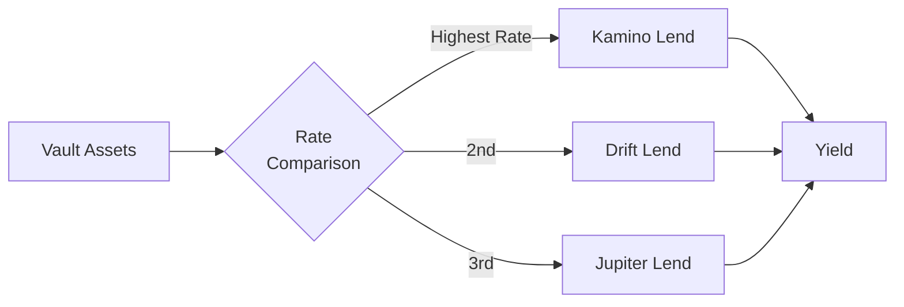

# Lending Aggregation

Lending aggregation forms the **Base Layer** of every Dawn Vault. It provides stable, always-on yield by deploying assets to the highest-rate lending protocol available.

## How It Works

1. The Manager Bot continuously monitors lending rates across supported protocols
2. Assets are allocated to the protocol offering the best risk-adjusted rate
3. When rates change significantly, assets are rebalanced to maintain optimal allocation

## Supported Protocols

| Protocol | Asset Support | Rate Range | Notes |
|----------|--------------|------------|-------|
| **Kamino Lend** | USDC, SOL | 3–8% | Established protocol with deep liquidity |
| **Drift Protocol** | USDC, SOL | 3–8% | Integrated with perps trading liquidity |
| **Jupiter Lend** | USDC | 3–8% | Growing protocol with competitive rates |

## Why Aggregation Matters

Lending rates fluctuate constantly based on supply/demand dynamics. A single protocol might offer the best rate today but not tomorrow. By actively monitoring and rebalancing across protocols, Dawn Vault captures consistently higher yields than a static single-protocol approach.

## Risk Profile

| Risk | Level | Mitigation |
|------|-------|-----------|
| Smart contract risk | Low–Medium | Multiple audited protocols; diversification reduces single-protocol exposure |
| Rate volatility | Low | Rebalancing captures rate changes |
| Liquidity risk | Low | Major protocols with deep liquidity pools |
| Opportunity cost | Low | Active monitoring minimizes time in suboptimal positions |

## Cost

Near zero — only Solana transaction fees (gas) for rebalancing operations.
