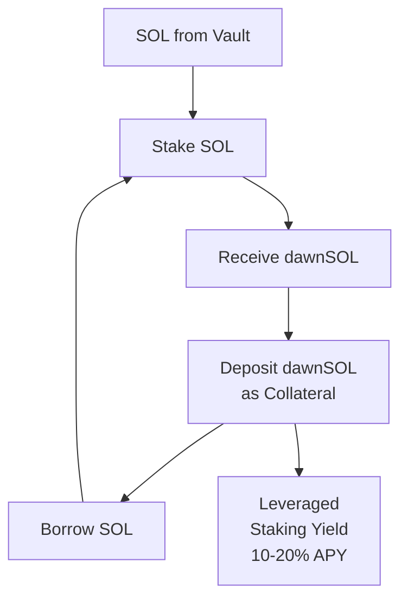

# LST Loop Strategy

The LST Loop is the **Alpha Layer** of the SOL Vault. It uses leveraged staking through Liquid Staking Tokens to amplify staking yield.

## Mechanism

### Step-by-Step

1. **Stake SOL** with Dawn Labs' validator → receive **dawnSOL**
2. **Deposit dawnSOL as collateral** on Kamino Lend (eMode)
3. **Borrow SOL** against the dawnSOL collateral
4. **Restake borrowed SOL** → more dawnSOL
5. **Repeat** to desired leverage level
6. Net yield = (Staking yield × leverage) − Borrow cost

## Two Implementation Paths

| | dawnSOL × Kamino | Jupiter Native Stake |
|---|---|---|
| **How it works** | Flash loan → swap → deposit → borrow → repay loop | Direct validator stake used as collateral |
| **Oracle Type** | Pyth Push Feed (market price-based) | Theoretical price (stake rate-based) |
| **Max Leverage** | ~10x via eMode | Varies by protocol |
| **LTV / Liquidation** | 87% / 88% (1% buffer) | Wider buffer |
| **Liquidation Mechanism** | Slot-level partial liquidation (0.1% min penalty) | Standard |
| **Setup Cost** | Flash loan fee 0.001%/use + swap slippage | Lower |
| **Best For** | Higher yield potential, experienced operators | Lower risk, simpler management |

## When It Activates

LST Loop is a **long-duration strategy** — positions are held for weeks to months. Frequent entry/exit incurs swap costs that erode returns.

| Condition | Staking | LST Loop | Trigger |
|-----------|---------|----------|---------|
| **Spread Wide** | 30–50% | 50–70% | LST yield − SOL borrow rate > 3% for 1 week |
| **Spread Narrow** | 80–90% | 10–20% | Monitor, maintain existing positions |
| **Negative Spread** | 100% | 0% | Spread < 0% for 2 weeks → gradual unwind |

## Risks

| Risk | Level | Details |
|------|-------|---------|
| **Rate Reversal** | Medium | SOL borrow rate exceeding staking yield creates negative carry |
| **Liquidation** | Medium–High | Tight LTV buffers (especially Kamino at 1%) require careful monitoring |
| **LST Depeg** | Low–Medium | Market price deviating from theoretical stake rate |
| **Smart Contract** | Low–Medium | Dependency on lending protocol security |
| **Swap Cost** | Low | Accumulated costs from frequent loop adjustments |

## Key Difference from Delta-Neutral

| | Delta-Neutral (USDC Vault) | LST Loop (SOL Vault) |
|---|---|---|
| **Market Exposure** | Zero (hedged) | Long SOL (amplified) |
| **Yield Source** | Funding rates + staking | Leveraged staking yield |
| **Rebalancing** | Daily–Weekly | Monthly |
| **Suitable Market** | High funding rate environment | Wide staking–borrow spread |
