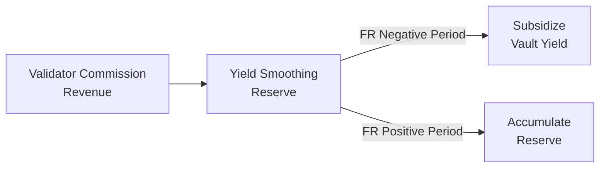

# Yield Smoothing Reserve

The Yield Smoothing Reserve (YSR) is a stabilization mechanism funded by Dawn Labs' validator commission revenue. It smooths APY volatility during unfavorable market conditions.

## How It Works



1. **Accumulation**: A portion of Dawn Labs' validator commission revenue flows into the Reserve
2. **Stabilization**: When funding rates turn negative and the Alpha Layer is deactivated, the Reserve supplements vault yield to reduce APY dips
3. **Recovery**: When conditions improve and the Alpha Layer reactivates, the Reserve replenishes

## Important Disclaimers

> The Yield Smoothing Reserve is a **stabilization mechanism**, not a guarantee.

- It does **not guarantee** any minimum APY
- It does **not insure** against losses
- Reserve size is limited and may be insufficient during prolonged adverse conditions
- The Reserve supplements yield — it does not replace strategy performance

## Why It Exists

Without the Reserve, vault APY would follow a pattern like:

```
FR Positive:  ████████████████ 25%
FR Neutral:   ████████         8%
FR Negative:  ████             4%  ← Sharp drop, depositors may withdraw
```

With the Reserve:

```
FR Positive:  ████████████████ 23%  ← Slightly lower (reserve accumulation)
FR Neutral:   █████████        9%
FR Negative:  ██████           6%  ← Smoother transition
```

The Reserve reduces the severity of APY dips, improving depositor experience and reducing panic withdrawals during temporary market downturns.

## Validator-Native Advantage

This mechanism is only possible because Dawn Labs operates a Solana validator. The commission revenue is an **external income stream** — it doesn't come from depositor funds or vault performance. This is a structural advantage that non-validator vault operators cannot replicate.

## Reserve Transparency

The Reserve balance is disclosed in every epoch report as part of our [Proof-Based Reporting](proof-based-reporting.md) framework. Depositors can track:

- Current reserve balance
- Reserve utilization rate
- Accumulation vs. distribution history
