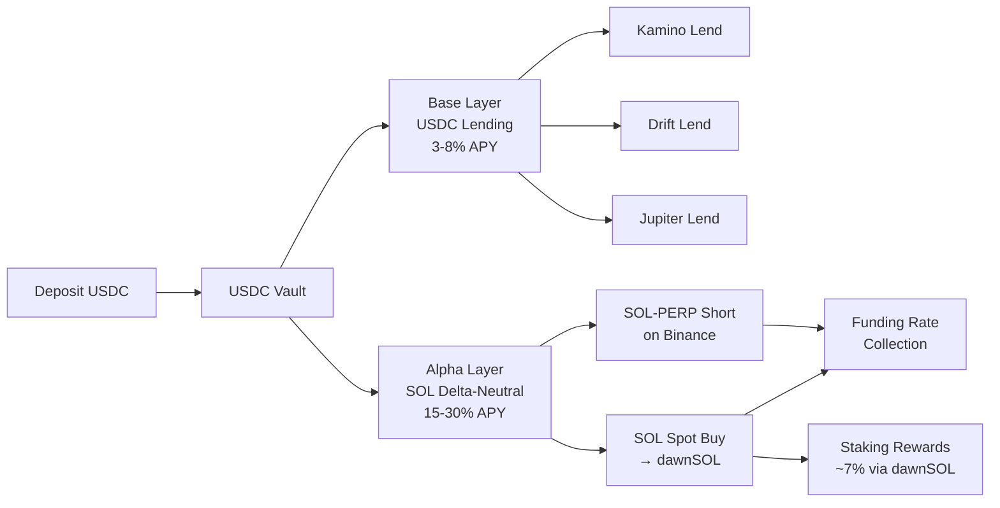

# USDC Vault

**Status: Live (Phase 1)**

The USDC Vault is Dawn Vault's flagship product. Deposit USDC and earn optimized yield through a combination of lending aggregation and delta-neutral strategies — all managed automatically.

## Overview

| Parameter | Value |
|-----------|-------|
| **Deposit Asset** | USDC |
| **Target APY** | 8–15%+ |
| **Base Layer** | USDC Lending (3–8%) |
| **Alpha Layer** | SOL Delta-Neutral (15–30%) |
| **Rebalancing** | Daily to weekly |
| **Decision Metric** | SOL Funding Rate |
| **Leverage** | 1x fixed (no leverage) |

## How It Works

### Base Layer: USDC Lending

USDC is deployed to the highest-yielding lending protocol among Kamino, Drift, and Jupiter Lend.

- **Always-on** — Generates yield regardless of market conditions
- **Expected APY**: 3–8%
- **Cost**: Near zero (gas fees only)
- **Risk**: Smart contract risk, protocol risk

### Alpha Layer: SOL Delta-Neutral

When SOL funding rates are sufficiently positive, a portion of USDC is allocated to a delta-neutral strategy:

1. **Buy SOL spot** with USDC → convert to **dawnSOL** (Dawn Labs' LST)
2. **Short SOL-PERP** on Binance for the same notional amount
3. **Collect funding rate** payments from long traders
4. **Earn staking rewards** (~7%) on the dawnSOL position

The result is a market-neutral position that profits from funding rates AND staking rewards simultaneously.

- **Conditional** — Only activated when SOL funding rates are sufficiently positive
- **Expected APY**: 15–30%
- **Cost**: Swap slippage on position open/close
- **Risk**: Funding rate reversal, basis divergence

> **No leverage is used.** For a $20,000 USDC allocation: $10,000 buys SOL spot (→ dawnSOL) + $10,000 serves as margin for SOL-PERP short. Margin = position size, so liquidation risk is effectively zero. We prioritize risk elimination over capital efficiency.

## Dynamic Allocation

The vault automatically adjusts the split between Base and Alpha layers based on SOL funding rate conditions:

| Market Condition | Lending Allocation | Delta-Neutral Allocation | Trigger |
|---|---|---|---|
| **FR High** | 30–50% | 50–70% | SOL FR > threshold sustained |
| **FR Neutral** | 70–80% | 20–30% | Maintain existing positions, new capital to lending |
| **FR Negative** | 100% | 0% (gradual exit) | FR < 0 sustained → close positions |

### Threshold Parameters

The following backtested parameters govern allocation decisions:

| Parameter | Value | Rationale |
|-----------|-------|-----------|
| **DN Entry** | SOL-PERP FR > 15% annualized for 2 days | Avoid acting on temporary spikes |
| **DN Reduction** | SOL-PERP FR < -2% annualized for 1 day | Stop new allocations, maintain existing |
| **DN Exit** | SOL-PERP FR < 0% for 3 days | Gradual position closure |
| **Emergency Exit** | SOL-PERP FR < -10% annualized | Immediate close — no time condition |
| **Max Allocation** | 70% of total assets | 30% liquidity buffer maintained |

> These thresholds are optimized through backtesting and continuously updated based on live performance. They are externalized as vault configuration — adjustable without code changes.

## Performance

### Backtest Results (5.5 Years)

Backtested using Binance SOL/USDT funding rate data from September 2020 to March 2026 (6,072 data points), with Drift FR correlation analysis.

| Metric | Value |
|--------|-------|
| **Annualized Return** | 8.57% |
| **Sharpe Ratio** | 13.41 |
| **Maximum Drawdown** | -0.07% |
| **DN Active Rate** | 23.9% of the time |
| **Cumulative Return** | +57% (vs. +32% lending-only → +25% excess return) |

**Optimal Parameters (Base APY 5%):**
- Entry: FR > 15% annualized × 2 days
- Exit: FR < -2% annualized × 1 day
- DN Allocation: 50%

### Stress Test Results

All five historical stress scenarios passed with maximum drawdown of 0.00%:
- 2022 May (LUNA collapse)
- 2024 August (market crash)
- 2025 October (flash crash)
- Extended negative FR periods
- Rapid FR reversal scenarios

## Risk Management

| Risk | Mitigation |
|------|-----------|
| **Funding Rate Reversal** | Automated exit based on backtested thresholds; gradual position reduction |
| **Smart Contract Risk** | Voltr framework audited; adapter whitelisting; non-custodial PDA custody |
| **Liquidation Risk** | 1x leverage (margin = position size) — effectively zero liquidation risk |
| **Basis Divergence** | Position sizing limits; spread monitoring |
| **Execution Risk** | Priority fee auto-adjustment; transaction retry logic |
| **Protocol Exploit** | Auto-withdrawal from affected protocol; asset quarantine in vault |

For comprehensive risk information, see [Risk Disclosures](../security/risk-disclosures.md).
